<div align="center">

<!-- Animated Header -->


<br>

*Engineering data architecture to support analytics and business intelligence*

<br>

<!-- Social Badges -->
[](https://linkedin.com/in/godsonkurishinkal)
[](mailto:godson.kurishinkal@gmail.com)
[](https://github.com/GodsonKurishinkal)

<br>

<!-- Profile Views -->


</div>

<br>

## 🎯 About Me

```python
class SeniorDataEngineer:
    def __init__(self):
        self.name = "Godson Kurishinkal"
        self.role = "Senior Data Engineer | Analytics Engineering & BI"
        self.location = "Dubai, UAE"
        self.company = "Landmark Group"
        
    def what_i_build(self):
        return """
        Analytics architecture and BI infrastructure—dimensional models,
        transformation layers, semantic consistency across 50+ reports.
        Turning operational data into automated business decisions.
        """
    
    def daily_stack(self):
        return ["Python", "SQL", "Polars", "DuckDB", "Azure", "Databricks", "Power BI"]
```

---

## 📊 Impact at a Glance

<div align="center">

<table>
<tr>
<td align="center" width="25%">

<br><b>Data Extraction</b>
<br><sub>4 hrs → 30 min</sub>
</td>
<td align="center" width="25%">

<br><b>Pipeline Uptime</b>
<br><sub>50+ ETL jobs</sub>
</td>
<td align="center" width="25%">

<br><b>Data Freshness</b>
<br><sub>48 hrs → 2-4 hrs</sub>
</td>
<td align="center" width="25%">

<br><b>Daily Processing</b>
<br><sub>Medallion Architecture</sub>
</td>
</tr>
</table>

</div>

---

## 🛠️ Tech Arsenal

<div align="center">

### Languages & Core


### Data Processing


### Cloud & Infrastructure


### Storage & Formats


### ML & Analytics


### Visualization & BI


### Automation


</div>

---

## 🏗️ Production Systems I've Built

<details>
<summary>🔷 <b>Medallion Data Lakehouse</b> — Enterprise Data Platform</summary>
<br>

Processing retail operations data through a three-layer architecture:

```mermaid
graph LR
    A[�� Sources] --> B[🥉 Bronze]
    B --> C[🥈 Silver]
    C --> D[🥇 Gold]
    
    subgraph Sources
    A1[ERP] --> A
    A2[CRM] --> A
    A3[WMS] --> A
    A4[OBI] --> A
    end
```



| Layer | Purpose | Tech |
|-------|---------|------|
| **Bronze** | Raw ingestion, schema-on-read | Polars, Parquet |
| **Silver** | Validated, deduplicated, typed | DuckDB, Hive Partitioning |
| **Gold** | Business aggregates, dimensions | Star Schema, Delta Lake |

</details>

<details>
<summary>📦 <b>Universal Replenishment Engine</b> — Inventory Optimization</summary>
<br>

Implementing sophisticated inventory policies:

- **(s,S) Policy** — Reorder point with order-up-to level
- **ABC-XYZ Classification** — Value × Demand variability matrix
- **Statistical Safety Stock** — Service level driven calculations
- **Scenario Configuration** — YAML-driven operational patterns

Supports: 3PL-to-warehouse, storage-to-picking, cross-dock operations

</details>

<details>
<summary>📈 <b>Demand Forecasting System</b> — 15+ Algorithm Ensemble</summary>
<br>

| Pattern Type | Classification | Algorithms |
|--------------|----------------|------------|
| Smooth | Low ADI, Low CV² | Moving Average, Exponential Smoothing |
| Intermittent | High ADI, Low CV² | Croston, SBA |
| Erratic | Low ADI, High CV² | ARIMA, Prophet |
| Lumpy | High ADI, High CV² | Ensemble with outlier handling |

Automated model selection based on ADI/CV² demand pattern classification.

</details>

<details>
<summary>🔍 <b>CBM Anomaly Detection</b> — Three-Tier Statistical System</summary>
<br>

```
Tier 1 ──► Validation Rules (Business Logic)
    │
    ▼
Tier 2 ──► Outlier Detection (IQR/Z-score)
    │
    ▼
Tier 3 ──► Volatility Analysis (Pattern Stability)
    │
    ▼
   📊 Priority Scoring ──► 500+ issues identified
```

</details>

<details>
<summary>🤖 <b>RPA Bot Framework</b> — Legacy System Automation</summary>
<br>

**Systems Integrated:** OBI, GCRM, GDMS, WMS

**Design Patterns:**
- Abstract Base Classes for bot behaviors
- Factory Pattern for bot instantiation
- Exponential Backoff for retry logic
- Structured logging for debugging

</details>

---

## ⚙️ Engineering Philosophy

<div align="center">

| Principle | Why It Matters |
|-----------|----------------|
| 🏛️ **Medallion Architecture** | Data quality gates at each layer |
| 🔄 **Idempotent Pipelines** | Safe re-runs, no duplicates |
| 📝 **Config-Driven Design** | YAML/dataclasses over hardcoding |
| 🛡️ **Error Handling** | Structured logging, graceful failures |
| 📐 **Type Hints** | Self-documenting, IDE-friendly code |
| 🧩 **Design Patterns** | Strategy, Factory, Template Method |

</div>

---

## 📍 Current Status

<div align="center">

| | |
|:---:|:---|
| 💼 | **Assistant Manager - MIS & Analytics** @ Landmark Group |
| 🎓 | **BS Data Science** @ IIT Madras *(in progress)* |
| 🎯 | **Focus:** Azure Databricks, Delta Lake, Microsoft Fabric |
| 📜 | **Pursuing:** DP-700, Databricks Data Engineer Associate & Professional |
| 🔍 | **Open to:** Senior/Lead/Staff Data Engineer roles in UAE |

</div>

---

## 📁 Featured Repositories

<div align="center">

| Repository | Description | Status |
|:-----------|:------------|:------:|
| `medallion-lakehouse` | Production lakehouse patterns with Polars + DuckDB | ✅ |
| `etl-framework` | Config-driven ETL with retry logic & logging | ✅ |
| `demand-forecasting` | ML ensemble for retail demand patterns | 🚧 |
| `rpa-automation` | Legacy system integration framework | 🚧 |

*Building public versions of production patterns*

</div>

---

## 📈 GitHub Stats

<div align="center">


<br><br>


</div>

---

<div align="center">

<!-- Animated Footer -->


**Dubai, UAE** · Open to Data Engineer opportunities

<sub>💡 *"Production code is code that someone depends on."*</sub>

</div>
